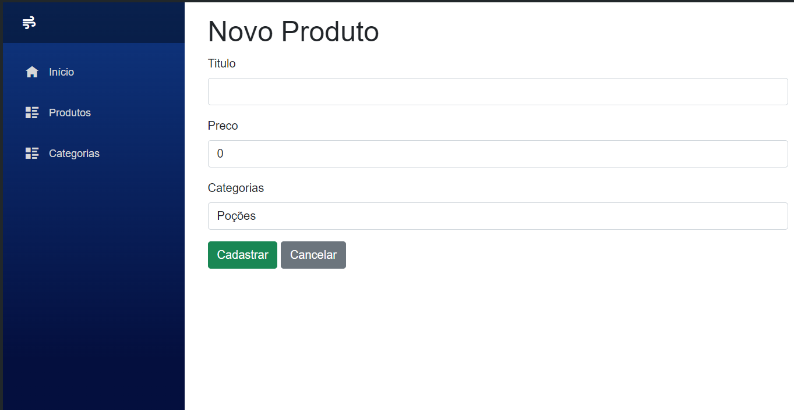
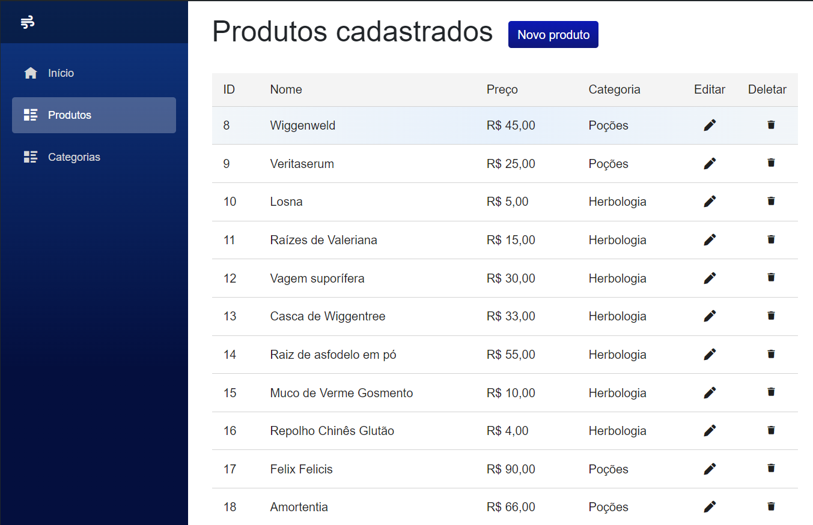
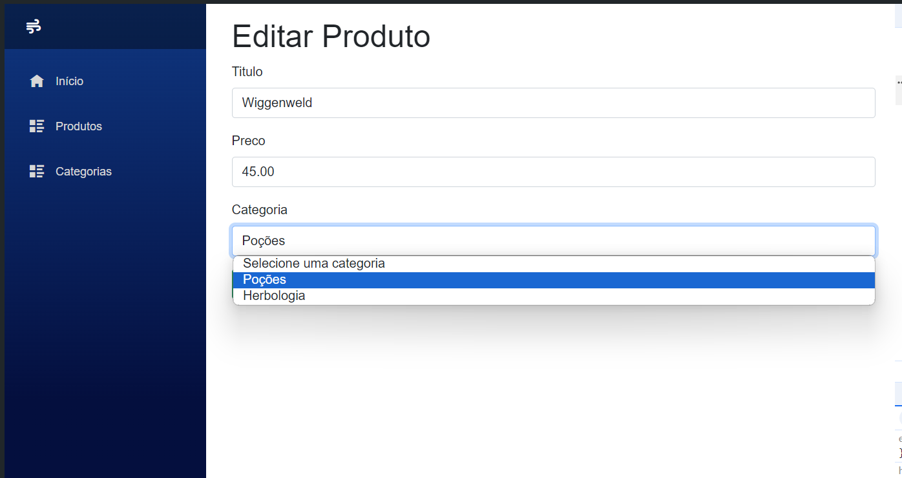

Esse é um projeto para estudar Blazor, iniciado como um sistema de estoque.

Estou usando:
- .NET
- Blazor Server
- CSS Scoped
- Data Annotations
- Migrations
- Entity Framework
etc

**Produtos**

**Categorias**
Também foram desenvolvidas as operações de banco de dados para as categorias, porém como seguem o mesmo padrão não adicionei imagens aqui.
